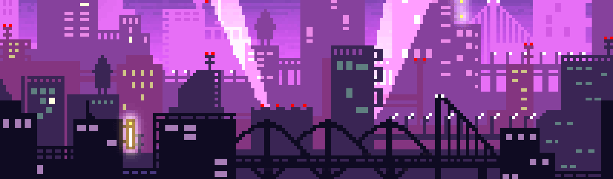

<!-- 
 -->

# Hello there, I'm Marianne 👋

## *I'm Junior Web Developer*

**Welcome on my Github page ! Here's a little more about me :**

>I'm french and I live in Lyon  
>I'm currently doing a professional re-orientation to work in web development. 
>I have acquired a lot of knowledges in different development languages thank to my school : O'clock    
>I used to work in computer design, which allowed me to develop my creative skills, and my stress management.

- 📫 How to reach me: `holveckmarianne@gmail.com`
- 🎙️ You can come and just chill : 
- ⚡ My portfolio will be here soon ! I promise

---

## **Projects :**

### *Current :*

| 💻 Projects  | 🛎 Technology | 📚 Forks | 📬 Pull requests |
| :--------------- | :---------------: | :---------------: | :---------------: |
| <a href="https://github.com/MarianneHolveck/Pokedex"><b>My Movies List</b></a>  |          |   |  |
<!-- | <a href="https://github.com/MarianneHolveck/Pokedex"><b>Movies and TvShows info</b></a>  |              |    |  | -->

### *Finished :*

| 💻 Projects  | 🛎 Technology | 📚 Forks | 📬 Pull requests |
| :--------------- | :---------------: | :---------------: | :---------------: |
| <a href="https://github.com/MarianneHolveck/Pokedex"><b>Pokedex</b></a>  |     |   |  |
| <a href="https://github.com/MarianneHolveck/Pokedex"><b>Game of Throne</b></a> |   |    |  |

---

## **I Work With :**

### *Languages*

  
  
  
  
  
  

### *Framework*

  
  
  

### *Tools*

---

## **Connect With Me**

